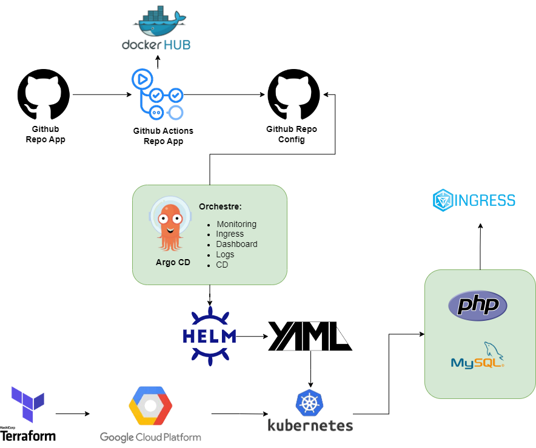

# Kubernetes Cluster Deployment Project

🔗 [Introduction](README.md) | [Installation](gcp-stack/README.md) 


This project focuses on designing and deploying a fully-equipped Kubernetes cluster to host and manage applications. The cluster will include essential management tools, administration components, and adhere to Kubernetes best practices. Additionally, an application currently deployed using Docker Compose will be converted and deployed using Kubernetes.
---

---
### Structure
```
ClusterGCP/
├── sample-app/                     # Laravel application source code
│   ├── app/
│   ├── public/
│   ├── composer.json
|   |── docker-compose.yml
│   └── ...                  # All other Laravel files and folders
├── helm/sample-app/ 
│   ├── Chart.yaml     # Helm chart for the application
│   ├── values.yaml
│   └── templates/
│       ├── deployment.yaml
│       ├── service.yaml  
│       ├── ingress.yaml
│       └── secret.yaml              
├── manifests/
│   ├── ingress-nginx/       # Optional: manifests or install notes for ingress
│   ├── monitoring/          # Manifests/notes for Prometheus and Grafana
│   ├── logging/             # Manifests/notes for Loki
│   └── security/            # Manifests/notes for Dex, OPA, etc.
├── overlays/
│   └── dev/                 # Environment-specific configuration (if used)
└── README.md
```
---
## Objectives

### Core Goals
1. **Cluster Management Tools**:
    - Internal load balancer for exposing apps and services (e.g., `nginx-ingress`).
    - User-friendly dashboard for container management (e.g., `kubernetes-dashboard`).
    - Monitoring stack for system and application metrics (e.g., `kube-prometheus`).
    - Logging stack for log collection and visualization (e.g., `loki`).
    - GitOps repository for reusable component manifests (e.g., `kustomize`).

2. **Application Deployment**:
    - Create a Helm chart for the application.
    - Use an official Helm chart for the database.
    - Automate deployment and verify application status.
    - Convert the Docker Compose application to Kubernetes.

3. **Best Practices**:
    - Define resource limits and requests for CPU and RAM.
    - Use Kubernetes Secrets for sensitive data.
    - Label resources following Kubernetes recommendations.
    - Add redundancy with multiple replicas and affinity rules.
    - Implement persistent storage for the database and a backup system.

4. **Security and Control**:
    - Add a validating webhook for request validation (e.g., `OPA`).
    - Implement authentication for the Kubernetes API and tools (e.g., `dex oauth-proxy`).

---

## Laboratory Environment

- **Azure DevTest Labs**:
  - Deploy virtual machines, services, and resources via the Azure Portal.
  - Use Terraform for Infrastructure as Code (IaC) (e.g., `azurerm_dev_test_linux_virtual_machine`).
  - Ensure cost optimization and compliance with Azure policies.
  - Shut down virtual machines daily to minimize costs.

---

## Delivery Requirements

1. Push all configurations to a Git repository.
2. Provide detailed documentation, including container setup steps and commands.

---

## Defense Requirements

1. Start a fresh Kubernetes cluster in the cloud with multiple nodes.
2. Deploy services using commands like `kubectl apply`, `kustomize`, and `helm`.
3. Demonstrate features such as auto-scaling with live scripts or commands.
4. Showcase deployment processes, including automatic rollback for failed deployments.
5. Optionally, simulate container failures (e.g., memory leaks or high CPU usage).

---

## Bonus Features

- Enable encryption with `Let’s Encrypt` and `cert-manager`.
- Use `argoCD` for managing components and GitOps repositories.
- Implement multi-tenancy and authentication for Prometheus and Loki (e.g., `kube-rbac-proxy`).
- Evaluate Helm artifact security.
- Define orchestrator access permissions.
- Reinforce network access security.
- Create lightweight Docker images.
- Guarantee zero-downtime deployments.
- Pull Docker images from a private registry.

---

## Tools and Technologies

- **Kubernetes**: Cluster orchestration.
- **Helm**: Package manager for Kubernetes.
- **Kustomize**: Template-free configuration management.
- **Terraform**: Infrastructure as Code.
- **Prometheus & Loki**: Monitoring and logging.
- **OPA**: Policy enforcement.
- **Dex OAuth-Proxy**: Authentication.

---

## Notes

- Ensure responsible resource management in the Azure environment.
- Follow Kubernetes best practices for scalability, security, and reliability.

---  
